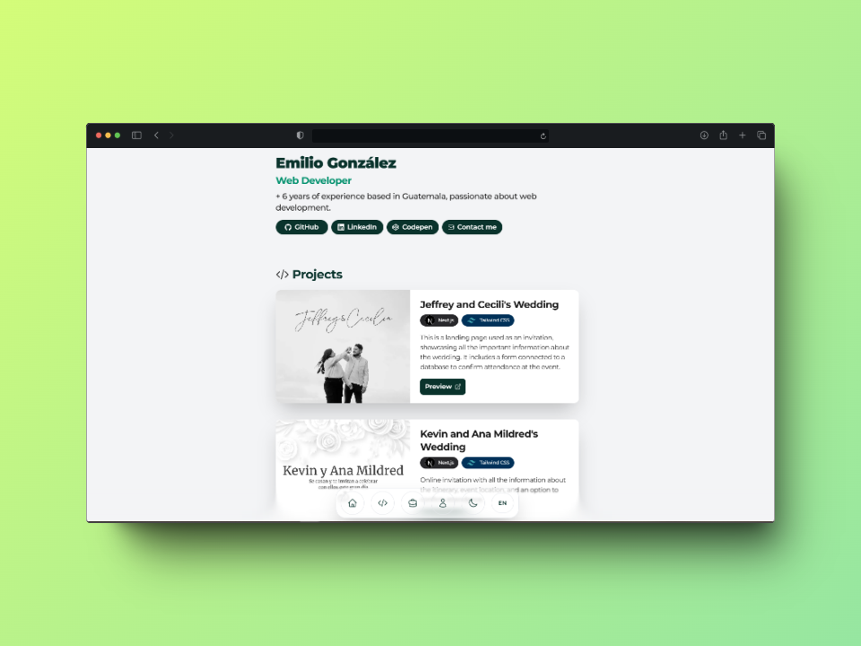

  <h1><strong>My Personal Website</strong></h1>
  

## 🛠️ Stack
- [**Next**](https://nextjs.com/](https://nextjs.org/)) - The React Framework for the Web.
- [**Typescript**](https://www.typescriptlang.org/) - JavaScript with type syntax.
- [**Tailwind CSS**](https://tailwindcss.com/) - Rapidly build modern websites without ever leaving your HTML.

## 🚀 Features
- 🌐 Internationalization (i18n) - Support for English and Spanish, allowing users to switch to their preferred language.
- 🎨 Theme switching - Toggle between light and dark modes using the power of TailwindCSS.
- ⚡ Optimized performance - Responsive design optimized for mobile devices.

## 🔑 License
[MIT](LICENSE) - Created by [**Emilio**](https://emiliogonzalez.dev) - Almost all rights reserved. 
